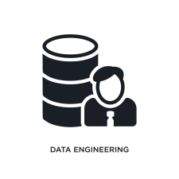

# Introduction to Data Analysis

Data analysis is a process of inspecting, cleansing, transforming, and modeling data with the goal of discovering useful information, informing conclusions, and supporting decision-making. Data analysis has multiple facets and approaches, encompassing diverse techniques under a variety of names, and is used in different business, science, and social science domains. In today's world, data is the new oil. It is the most valuable resource in the world.

## 🕹️ Table of Contents

- [🌀 Data Analytics Life Cycle](#-data-analytics-life-cycle)
- [👨🏻‍💼 Career Roles in The Data Analytics Lifecycle](#-career-roles-in-the-data-analytics-lifecycle)
- [🔬 Analyst vs. Scientist vs. Engineer](#-analyst-vs-scientist-vs-engineer)

## 🌀 Data Analytics Life Cycle

## 👨🏻‍💼 Career Roles in The Data Analytics Lifecycle

## 🔬 Analyst vs. Scientist vs. Engineer

| Data Engineer                                                                                    | Data Analyst                                                                              | Data Scientist                                                                               |
| ------------------------------------------------------------------------------------------------ | ----------------------------------------------------------------------------------------- | -------------------------------------------------------------------------------------------- |
|                                                          |                                      |                                                        |
| Build and optimize the systems that allow data scientist and data analysis to perform their work | Deliver value by analyzing dat, communicating the results to help make business decisions | Use data to solve business problems                                                          |
| **Requirement:**  1. Strong Programming Skills   2. Cloung Computing tech   3. Big Data | **Requirement:**   1. Communication Skills   2. Business savvy/ Domain Knowledge    | **Requirement:**   1. Statistics   2. Math   3. Programming Skills   4. Big Data |

##
