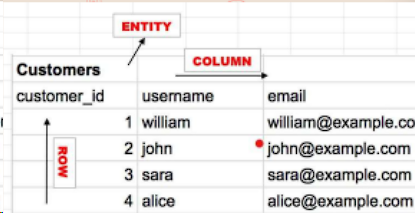
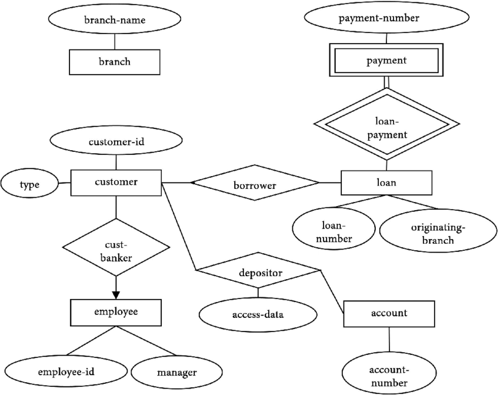
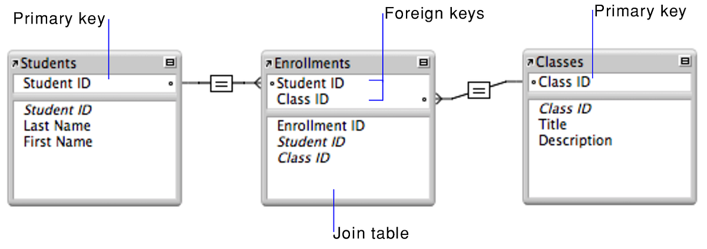
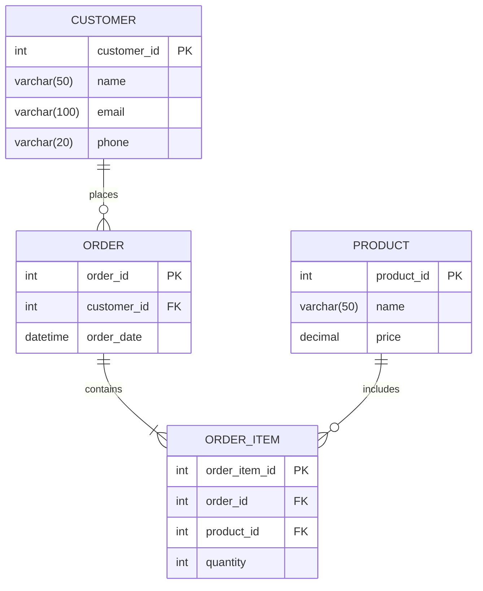

# 🗄️ Database

Database is a group of information that's stored systematically in a computer so that it can be checked using a software program to obtain information. It could be a collection of data that's organized in a way that a computer program can quickly select desired pieces of data.

<!-- TOC -->
- [🔗 Entity Model Relationship](#-entity-model-relationship)
- [🗝️ Key Types](#️-key-types)
- [📨 Database Management System (DBMS)](#-database-management-system-dbms)
  - [Types of DBMS](#types-of-dbms)
- [📦 Database Types](#-database-types)
- [🔢 Data Types](#-data-types)
  - [Primitive](#primitive)
  - [Composite](#composite)
- [🔳 Entity Relationship Diagram (ERD)](#-entity-relationship-diagram-erd)
- [🪶 Assignment](#-assignment)
<!-- /TOC -->

## 🔗 Entity Model Relationship

- `Entity`: a thing or object in the real world that's distinguishable from other objects. For example, each person is an entity, and bank account is an entity.
- `Attribute`: a property or characteristic of an entity. For example, a person's age, name, and address are attributes.
- `Relationship`: a meaningful association between entities. For example, a person can have a relationship with a bank account.

## 🗝️ Key Types

- `Primary Key`: a unique identifier for each record in a table. It's a unique value that can be used to identify a single row of a table. It's a unique value that can be used to identify a single row of a table.
- `Foreign Key`: a column or group of columns in a relational database table that provides a link between data in two tables. It's a field in a relational table that matches the primary key column of another table.

## 📨 Database Management System (DBMS)

A database management system (DBMS) is a software package designed to define, manipulate, retrieve, and manage data in a database. A DBMS generally manipulates the data itself, the data format, field names, record structure, and file structure. It also defines rules to validate and manipulate this data.

### Types of DBMS

- `Relational Database Management System (RDBMS)`: a type of DBMS that stores data in the form of related tables. It's a database management system based on the relational model. It's a collection of data items organized as a set of formally described tables from which data can be accessed or reassembled in many different ways without having to reorganize the database tables.

- `NoSQL Database Management System`: a type of DBMS that provides a mechanism for storage and retrieval of data that is modeled in means other than the tabular relations used in relational databases. NoSQL databases are increasingly used in big data and real-time web applications. NoSQL systems are also sometimes called "Not only SQL" to emphasize that they may support SQL-like query languages or sit alongside SQL databases in polyglot-persistent architectures.

- `Object-Oriented Database Management System (OODBMS)`: a type of DBMS that supports the creation and modeling of data as objects. It's a database management system in which information is represented in the form of objects as used in object-oriented programming.

## 📦 Database Types

- `Relational Database`: a database based on the relational model. It's a collection of data items organized as a set of formally described tables from which data can be accessed or reassembled in many different ways without having to reorganize the database tables. The relational database was invented by E. F. Codd at IBM in 1970.
- `NoSQL Database`: a database that provides a mechanism for storage and retrieval of data that is modeled in means other than the tabular relations used in relational databases. NoSQL databases are increasingly used in big data and real-time web applications. NoSQL systems are also sometimes called "Not only SQL" to emphasize that they may support SQL-like query languages or sit alongside SQL databases in polyglot-persistent architectures.

## 🔢 Data Types

Database data types refer to the `kinds of values` that can be stored in a specific column or field within a table. Each database has a set of data types available, and selecting the right one is crucial to ensure data integrity, storage efficiency, and consistency in data manipulation. Here are some common data types often used in databases:

### Primitive

- `Integer`: Used to store whole numbers. Examples include 1, 10, -5, and so on. This data type is usually available in various sizes, such as `INT`, `SMALLINT`, and `BIGINT`, determining the range of values that can be stored.

- `Floating` : Used to store floating-point or decimal numbers. This data type is suitable for values like 3.14, 0.005, and so on. Examples of data types used are `FLOAT` and `DOUBLE`.

- `Character`: Used to store data in the form of characters or text strings. This data type is suitable for storing names, addresses, and other text information. Examples of data types used are `CHAR` and `VARCHAR`.

- `Boolean`: This data type has only two values, true or false. It is usually represented as `1`(true) or `0` (false) in the database.

- `Date and Time`: Used to store dates, times, or a combination of both. This data type allows operations such as calculating the duration between two dates or sorting based on time. Examples of data types used are `DATE`, `TIME`, and `TIMESTAMP`.

- `Binary`: Used to store binary data, such as images, audio, or video. This data type allows storage and manipulation of unstructured data.

- `Enum`: This data type allows us to define a set of possible values for a particular column. An enum column can have one of the predetermined values. Examples include order status, which could be `pending`, `processing`, or `completed`.

### Composite

- `Array`: It's a composite data type that allows you to store multiple values of the same data type in a single column. It's particularly useful when dealing with lists or collections of similar items
- `Object`: It's a composite data type that allows you to store complex data structures in a single column. It's particularly useful when dealing with nested data or complex objects. Object is used when we need to store more than one value in 1 variable. Example: `address` can be an object with `street`, `city`, `state`, `zip` as its properties.

## 🔳 Entity Relationship Diagram (ERD)

An entity-relationship diagram (ERD) is a data modeling technique that graphically illustrates an information system's entities and the relationships between those entities. An ERD is a conceptual and representational model of data used to represent the entity framework infrastructure. It's a graphical representation of entities and their relationships to each other, typically used in computing in regard to the organization of data within databases or information systems.

## 🪶 Assignment

Make 3 ERD Example like this with caption and explanation. You can use any tools to create the ERD.

