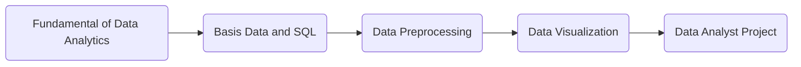

# Data Analyst Iscom 2024

Syllabus

- [📈 Introduction to Data Analysis](#-introduction-to-data-analysis)
- [🐍 Introduction to Python](#-introduction-to-python)
- [🗄️ Database](#️-database)

## 🚧 About ISCOM

ISCOM (Information System Community) is community that have objective to elevate student skill around information system.

ISCOM focused on 5 division which wasUI/UX, Programming, IoT, Business Plan, also Data Analyst. With this Community we hope that student can learn more about Information System and can be more prepared to face the real world.

## 🖇️ Resources

[📂 Sharing Drive](https://drive.google.com/drive/folders/10BLbAu9xTamxvLkdS0iiDTNsVZDHtoO8)

## 🛣️ Roadmap

## 🧑🏻‍🦱 Work Flow

- Weekly Sharing Session
- Monthly Sharing Session

## Syllabus

> [!NOTE]
> This Material are only from ISCOM Weekly Session and Monthly Session.

### [📈 Introduction to Data Analysis](/01-intro-data/README.md)

- Introduction and Overview
- Fundamental of Data Analysis
- Sharing Session
- QnA

### [🐍 Introduction to Python](/02-intro-python/README.md)

- Python Programming
- Variable and Data Types
- Arithmetic Operations
- QnA

### [🗄️ Database](/03-database/README.md)

- Entity Model Relationship
- Key Types
- Database Management System (DBMS)
- Database Types
- Data Types
- Assignment
